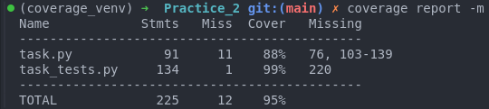
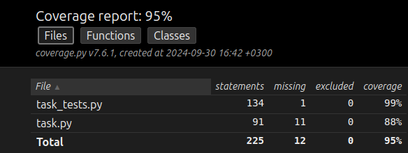

# Практическая работа №2: Тестирование данных для сервиса, полученных из API

## Содержание

- [Введение](#введение)
- [Задание](#задание)
- [Ход работы](#ход-работы)
	* [Класс `Ingredient`](#класс-ingredient)
	* [Класс `Receipt`](#класс-receipt)
	* [Проверка на блюдах из списка](#проверка-на-блюдах-из-списка)
- [Тестирование](#тестирование)
	* [Тестирование для класса `Ingredient`](#тестирование-для-класса-ingredient)
	* [Тестирование для класса `Receipt`](#тестирование-для-класса-receipt)
- [Покытие тестами](#покрытие-тестами)

## Введение

Представим, что мы хотим сделать сервис, связанный с рецептами и ресторанами.
И пока согласуем доступ по API к хранилищу рецептов (пишет и наполняет другая команда),
мы пишем свой код для рассчёта расходов на закупку ингредиентов.
Нам передали данные как бы мы получили их по проектируемому API.

## Задание

Нужно создать два класса. 

**Один Ингредиент, а другой Рецепт.**

Подберите блюдо, которое название которого начинается с той же буквы, что и Ваша фамилия.

Указать в комментарии в начале файла: `#(И)ванов -> (И)нжирный кекс`

Подобрать блюдо поможет [ссылка](https://ru.wikipedia.org/wiki/%D0%9A%D0%B0%D1%82%D0%B5%D0%B3%D0%BE%D1%80%D0%B8%D1%8F:%D0%91%D0%BB%D1%8E%D0%B4%D0%B0_%D0%BF%D0%BE_%D0%B0%D0%BB%D1%84%D0%B0%D0%B2%D0%B8%D1%82%D1%83).


Если в рецепте мало ингредиентов, их можно добавить... По Вашему вкусу. Пусть их будет 5+.
Можно придумать ("приготовить") собственный рецепт. 

Следует написать `python-код` так, чтобы выполнялись следующие минимальные условия:

- создать `класс Ингредиент`, описывающий ингредиент (название, вес, и т.д.). Значения характеристик ингредиента определите "на глаз".

- создать `класс Рецепт`, отвечающий на вопросы: "Вес сырого продукта?", "Вес готового продукта?", "Себестоимость?". В классах добавить/реализовать необходимые методы рассчёта.

Исходный Рецепт должен быть записан в виде словаря (Как в шаблоне).

Написать `unittest` в отдельном файле с использованием `setUp()` и `SetUpClass()` методов. (`TearDown()`, `TearDownClass()`)

По аналогии, подберите и второе блюдо, но начинающееся с буквы имени. Протестируйте свои классы и на нём.

Проведите замер покрытия тестами.

Ожидается, что все задания практики делаются в git-репозитории. Не забывайте коммитить готовые фичи по ходу выполнения задания.

## Ход работы

### Класс `Ingredient`

Для выполнения данной практической работы был написан класс `Ingredient` с встроенной валидацией входных данных (title, raw_weight, weight, cost):

``` Python
class Ingredient:
	def __init__(self, title:str, raw_weight:(int, float), weight:(int, float), cost:(int, float)) -> None:
		self.title = title
		self.raw_weight = raw_weight
		self.weight = weight
		self.cost = cost

	@property
	def title(self):
		return self._title
	
	@title.setter
	def title(self, value):
		if not isinstance(value, str):
			raise ValueError('Название должно быть строковым значением')
		self._title = value
	
	@property
	def raw_weight(self):
		return self._raw_weight
	
	@raw_weight.setter
	def raw_weight(self, value):
		if not isinstance(value, (int, float)) or value <= 0:
			raise ValueError('Сырой вес должен быть положительным числом')
		self._raw_weight = value
	
	@property
	def weight(self):
		return self._weight
	
	@weight.setter
	def weight(self, value):
		if not isinstance(value, (int, float)) or value <= 0:
			raise ValueError('Вес должен быть положительным числом')
		self._weight = value
	
	@property
	def cost(self):
		return self._cost
	
	@cost.setter
	def cost(self, value):
		if not isinstance(value, (int, float)) or value <= 0:
			raise ValueError('Цена должна быть положительным числом')
		self._cost = value;
	
	def __str__(self):
		return f'  {self.title}:\n    Сырой вес: {self.raw_weight}\n    Вес: {self.weight}\n    Цена: {self.cost}'
```

### Класс `Receipt`

Также был создан класс `Receipt` с валидацией входных данных и заполнением массива ингредиентов на основе входных данных:

``` Python
class Receipt:
	def __init__(self, title:str, ingredients_list:list[tuple[str, (int, float), (int, float)]]) -> None:
		self.title = title;
		self.ingredients = [Ingredient(title, raw_weight, weight, cost) for title, raw_weight, weight, cost in ingredients_list]
	
	@property
	def title(self):
		return self._title
	
	@title.setter
	def title(self, value):
		if not isinstance(value, str):
			raise ValueError('Название должно быть строковым значением')
		self._title = value;
	
	@property
	def ingredients(self):
		return self._ingredients
	
	@ingredients.setter
	def ingredients(self, value):
		if not value:
			raise ValueError('Список ингредиентов не может быть пустым')
		if not all(isinstance(item, Ingredient) for item in value):
			raise ValueError('Все элементы списка должны быть объектами класса Ingredient')
		self._ingredients = value
	
	def calc_raw_weight(self, portions=1):
		result = 0
		for ingredient in self.ingredients:
			result += ingredient.raw_weight
		return result * portions
	
	def calc_weight(self, portions=1):
		result = 0
		for ingredient in self.ingredients:
			result += ingredient.weight
		return result * portions
	
	def calc_cost(self, portions=1):
		result = 0
		for ingredient in self.ingredients:
			result += ingredient.cost
		return result * portions
	
	def __str__(self):
		ingredients_str = '\n'.join(str(ingredient) for ingredient in self.ingredients)
		return f'Блюдо: {self.title}\nИгредиенты:\n{ingredients_str}'
```

### Проверка на блюдах из списка

После этого была написана проверка работоспособности классов:

``` Python
if __name__ == '__main__':
	print('--------------------------------')
	
	# (Ш)амров -> (Ш)трудель
	receipt_from_api_surname = {
		'title': 'Штрудель',
		'ingredients_list': [
			('Мука', 150, 140, 30),
			('Сахар', 50, 50, 15),
			('Яблоки', 300, 280, 120),
			('Масло сливочное', 100, 90, 80),
			('Корица', 5, 5, 10),
			('Лимонный сок', 10, 10, 5),
		],
	}

	print('(Ш)амров -> (Ш)трудель\n')
	receipt_surname = Receipt(receipt_from_api_surname['title'], receipt_from_api_surname['ingredients_list'])
	print(receipt_surname.__str__())

	print('--------------------------------')

	# (И)лья -> (И)тонская путаница
	receipt_from_api_name = {
		'title': 'Итонская путаница',
		'ingredients_list': [
			('Клубника', 500, 450, 200),
			('Сливки', 300, 300, 150),
			('Сахарная пудра', 50, 50, 20),
			('Безе', 200, 200, 100),
			('Ванильный экстракт', 5, 5, 30),
			('Мята', 10, 10, 15)
		]
	}

	print('(И)лья -> (И)тонская путаница\n')
	receipt_name = Receipt(receipt_from_api_name['title'], receipt_from_api_name['ingredients_list'])
	print(receipt_name.__str__())
```

Результирующий вывод данной программы:

``` Text
--------------------------------
(Ш)амров -> (Ш)трудель

Блюдо: Штрудель
Игредиенты:
  Мука:
    Сырой вес: 150
    Вес: 140
    Цена: 30
  Сахар:
    Сырой вес: 50
    Вес: 50
    Цена: 15
  Яблоки:
    Сырой вес: 300
    Вес: 280
    Цена: 120
  Масло сливочное:
    Сырой вес: 100
    Вес: 90
    Цена: 80
  Корица:
    Сырой вес: 5
    Вес: 5
    Цена: 10
  Лимонный сок:
    Сырой вес: 10
    Вес: 10
    Цена: 5
--------------------------------
(И)лья -> (И)тонская путаница

Блюдо: Итонская путаница
Игредиенты:
  Клубника:
    Сырой вес: 500
    Вес: 450
    Цена: 200
  Сливки:
    Сырой вес: 300
    Вес: 300
    Цена: 150
  Сахарная пудра:
    Сырой вес: 50
    Вес: 50
    Цена: 20
  Безе:
    Сырой вес: 200
    Вес: 200
    Цена: 100
  Ванильный экстракт:
    Сырой вес: 5
    Вес: 5
    Цена: 30
  Мята:
    Сырой вес: 10
    Вес: 10
    Цена: 15
```

## Тестирование

Тестирование было выполнено с помощью `unittest` с использованием `setUp()`, `setUpClass()`, `tearDown()`, `tearDownClass()`.

### тестирование для класса `Ingredient`

``` Python
class TestIngredient(unittest.TestCase):

	@classmethod
	def setUpClass(cls):
		cls.ingredient_data = {
			'title': 'Мука',
			'raw_weight': 150,
			'weight': 140,
			'cost': 30
		}
	
	def setUp(self):
		self.ingredient = Ingredient(
			self.ingredient_data['title'],
			self.ingredient_data['raw_weight'],
			self.ingredient_data['weight'],
			self.ingredient_data['cost']
		)
	
	def tearDown(self):
		del self.ingredient
	
	@classmethod
	def tearDownClass(cls):
		cls.ingredient_data = None

	def test_valid_ingredient(self):
		self.assertEqual(self.ingredient.title, 'Мука'),
		self.assertEqual(self.ingredient.raw_weight, 150),
		self.assertEqual(self.ingredient.weight, 140),
		self.assertEqual(self.ingredient.cost, 30)
	
	def test_title_setter(self):
		with self.assertRaises(ValueError):
			self.ingredient.title = 12
	
	def test_raw_weight_setter_1(self):
		with self.assertRaises(ValueError):
			self.ingredient.raw_weight = 'Строка'
	
	def test_raw_weight_setter_2(self):
		with self.assertRaises(ValueError):
			self.ingredient.raw_weight = -4543
	
	def test_raw_weight_setter_3(self):
		with self.assertRaises(ValueError):
			self.ingredient.raw_weight = 0
	
	def test_weight_setter_1(self):
		with self.assertRaises(ValueError):
			self.ingredient.weight = 'Строка'
	
	def test_weight_setter_2(self):
		with self.assertRaises(ValueError):
			self.ingredient.weight = -93.12
	
	def test_weight_setter_3(self):
		with self.assertRaises(ValueError):
			self.ingredient.weight = 0
	
	def test_cost_setter_1(self):
		with self.assertRaises(ValueError):
			self.ingredient.cost = 'Строка'
	def test_cost_setter_2(self):
		with self.assertRaises(ValueError):
			self.ingredient.cost = -35
	def test_cost_setter_3(self):
		with self.assertRaises(ValueError):
			self.ingredient.cost = 0
```

### Тестирование для класса `Receipt`

``` Python
class TestReceiptSurname(unittest.TestCase):

	@classmethod
	def setUpClass(cls):
		cls.receipt_title = 'Штрудель'
		cls.receipt_ingredients_data = [
			('Мука', 150, 140, 30),
			('Сахар', 50, 50, 15),
			('Яблоки', 300, 280, 120),
			('Масло сливочное', 100, 90, 80),
			('Корица', 5, 5, 10),
			('Лимонный сок', 10, 10, 5)
		]

	def setUp(self):
		self.receipt = Receipt(self.receipt_title, self.receipt_ingredients_data)

	def tearDown(self):
		del self.receipt

	@classmethod
	def tearDownClass(cls):
		cls.receipt_title = None
		cls.receipt_ingredients_data = None

	def test_valid_receipt(self):
		self.assertEqual(self.receipt.title, 'Штрудель')
		self.assertEqual(len(self.receipt.ingredients), 6)

	def test_title_setter(self):
		with self.assertRaises(ValueError):
			self.receipt.title = 453

	def test_calc_raw_weight(self):
		self.assertEqual(self.receipt.calc_raw_weight(), 615)
		self.assertEqual(self.receipt.calc_raw_weight(2), 1230)

	def test_calc_weight(self):
		self.assertEqual(self.receipt.calc_weight(), 575)
		self.assertEqual(self.receipt.calc_weight(3), 1725)

	def test_calc_cost(self):
		self.assertEqual(self.receipt.calc_cost(), 260)
		self.assertEqual(self.receipt.calc_cost(4), 1040)

	def test_empty_ingredients_list(self):
		with self.assertRaises(ValueError):
			Receipt('Пустой рецепт', [])

	def test_invalid_ingredient_type(self):
		invalid_ingredients = [('Мука', 150, 140, 30), 'Неправильный ингредиент']
		with self.assertRaises(ValueError):
			Receipt('Неправильный рецепт', invalid_ingredients)

	def test_zero_portions(self):
		self.assertEqual(self.receipt.calc_raw_weight(0), 0)
		self.assertEqual(self.receipt.calc_weight(0), 0)
		self.assertEqual(self.receipt.calc_cost(0), 0)
```

## Покрытие тестами

Для выполнения проверки покрытия тестами необходимо создать виртульное окружение, чтобы в него установить инструмент `coverage` и проивести замер покртыия с помощью следующих команд:

``` Bash
python3 -m venv coverage_venv
source coverage_venv/bin/activate

(coverage_venv) pip install coverage
(coverage_venv) coverage run -m unittest task_tests.py
(coverage_venv) coverage report -m
```

Результат вывода покрытия:



Также можно сгенерировать `html` файл с описанием покрытия тестами с помощью следующей команды внутри виртуального окружения (файл для открытия находится по пути `./htmlcov/index.html`):

``` Bash
(coverage_venv) coverage html
```

